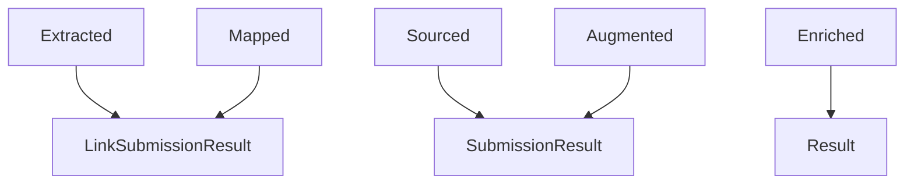
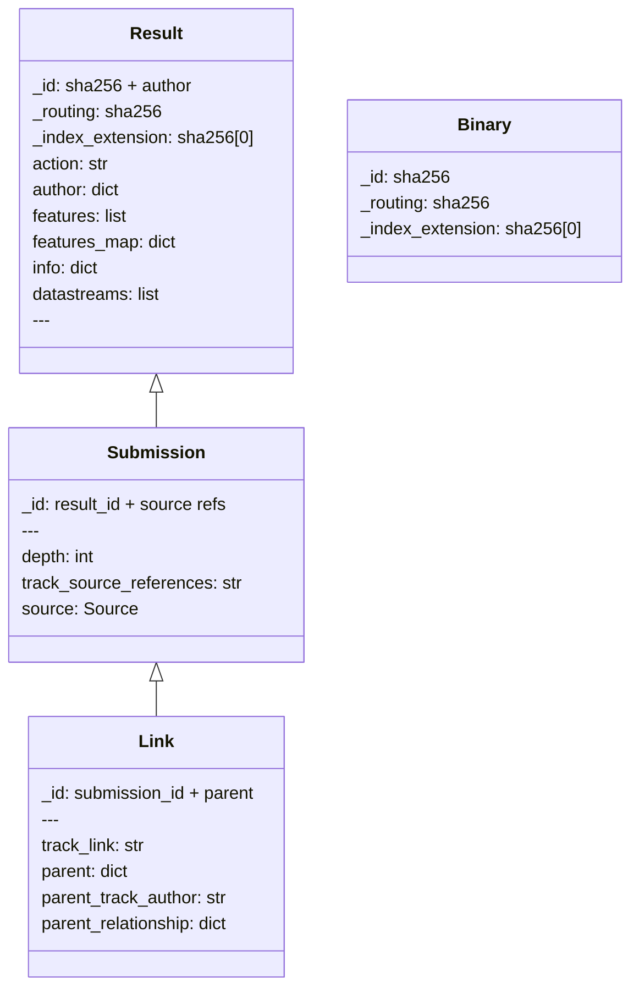

# Binary2 Benefits

## Combined binary searches

Allows queries for a single binary across multiple results of plugins, and freely combine this information.
i.e. find binaries with feature from plugin 1 that also has info from plugin 2

This was implemented with an opensearch parent-child relationship.

The parent document contains very little information,
it is purely used to create a single parent document for each unique sha256.

This costs ingest time, as now 2 documents are created instead of 1.
The extra document contains little information but still has a performance hit.

The document layout has been designed so that most restapi queries do not need to use the parent-child relationship.

Traversing that relationship in a query has a performance cost.

The 'binary_find' operation uses parent-child to enable 'AND' logic to function over multiple child documents.

## Deduplication

The change to binary2 has reduced the amount of data being stored in Opensearch.

This was achieved by splitting the documents up into smaller parts,
then specific common properties collide and those can be deleted as duplicates.

As only `sha256 + author` is used as a key,
only 1 copy of a plugins features is retained in opensearch per binary.

As opensearch is efficient for searches on this data, this optimisation primarily reduces disk usage over time.

## Flat structure

The `entity` object has been removed and any fields have been moved to the root of the document.
This makes it simpler for users to construct queries against important fields.

### Cache

The dedupe cache is designed to prevent writes of the typical data sent to opensearch multiple times.

This cache is used for all binary ingestions and reduces the deduplication needed to be done by opensearch.

It is designed to send docs to opensearch only if

- id has not been seen
- id has been seen and author version is different
- id has been seen and age off window is expected to increase

This means that if a plugin is updated but version has not been increased, 
repeat events produced will be skipped if they are still in the dedupe cache.

The cache is not shared between ingestors instances so it is better to run as few as possible to keep up with load.
Running multiple ingestors will lead to a larger 'delete' count as redundant docs are overwritten more frequently.

## Index structure

For parent-child and collisions to work, all docs associated with a sha256 must be present on a single index.

e.g the indices will be (all possible hex values) `binary2.1, binary2.2, ... binary2.e, binary2.f`

The only reliable property to use is something derived from a sha256.
The first few characters of the sha256 are used and events are routed and stored based on that prefix.

As indices are not time-bound this means that a reingest with larger sharding may be needed in the future.

Document deletion is expected to occur due to the constant expected id collisions as part of deduplication.
Many of these will be caught by the cache but some will slip through. These are cleaned up automatically over time.
Suggest not clearing manually as this can cause issues with opensearch.

## Ageoff

Not all documents track source information which makes ageoff more complex.

Ageoff is now a multi-stage operation.

- The first stage will delete OLD metadata docs with source info. (Submission Document)
- The second stage will delete parent docs that have no child metadata with source info. (Binary/Link)
- The third stage will delete metadata docs that have no parent. (Result)

## Purge

Documents now do not track complete source path information which makes purge more complex.

Similar to ageoff, purge is now a multi-stage operation.

Submission purges are relatively simple and function like an ageoff.

More complex purge operations now must recursively scan and purge children.

## Possible Documents

As these documents are being placed onto the same index, they share the same mapping.

Each 'action' results in a different set of metadata being retained from the binary event, to encourage deduplication of documents when desired.

- Binary
  - Nearly empty document used as the 'parent' for all the other documents
  - Very frequently deduplicated (whenever event for same sha256 seen)
  - ID: "\{sha256\}"
- Result
  - Contains associated features, info and datastreams
  - ID: "\{sha256\}.\{author\}"
- Submission
  - Describes a source of the current binary
  - Includes direct and indirect sources
  - Also always contains result
  - ID: "\{sha256\}.\{author\}.\{submission\}"
- Link
  - Describes a parent of the current binary
  - Also always contains submission and result
  - ID: "\{sha256\}.\{author\}.\{submission\}.\{link\}"

---

Diagram of 'action' -> 'retained metadata' as follows.
All event types will try to create the 'binary' parent document as well.

---

Possible properties that are set in events:

## Known issues and future improvements

In the future a shared cache may be implement with redis. This should be done if the number of 'deleted' docs per index is impacting disk usage or performance, or the ingestors cannot keep up with incoming documents.
